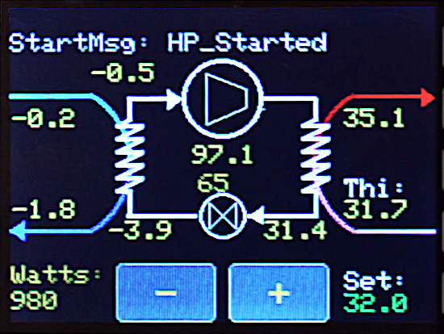
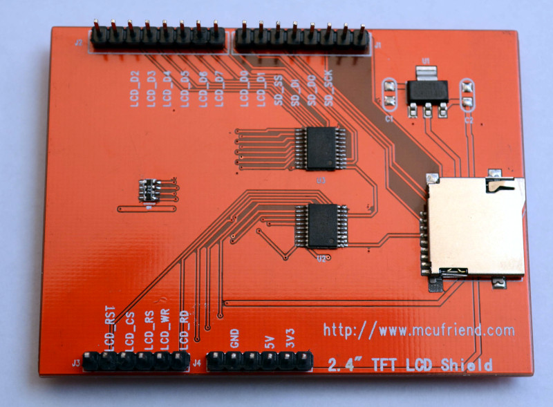
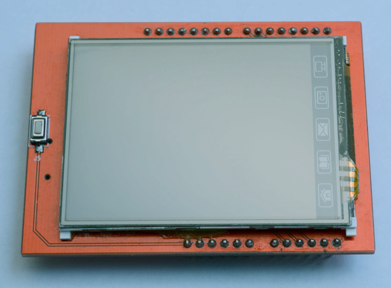
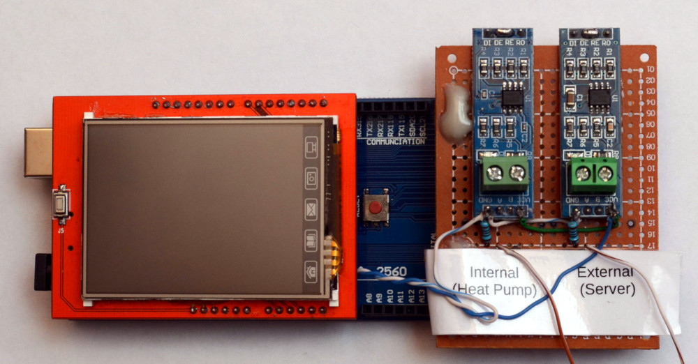
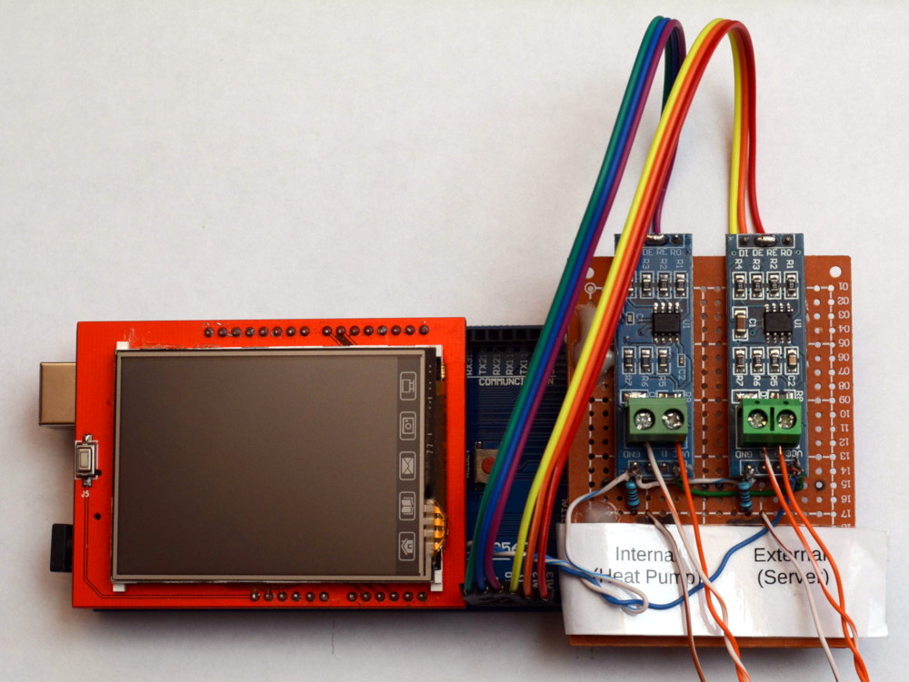
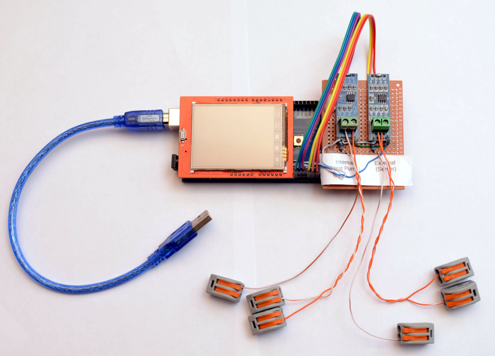
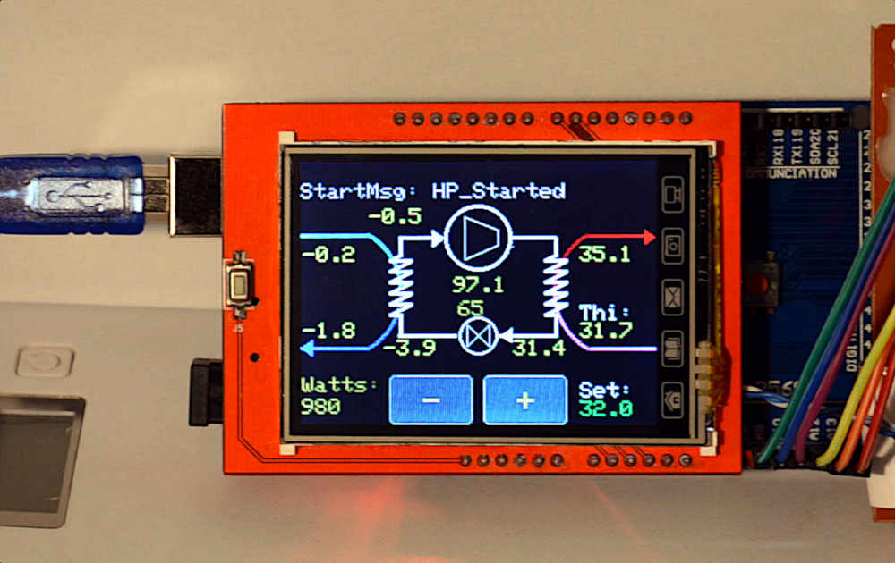
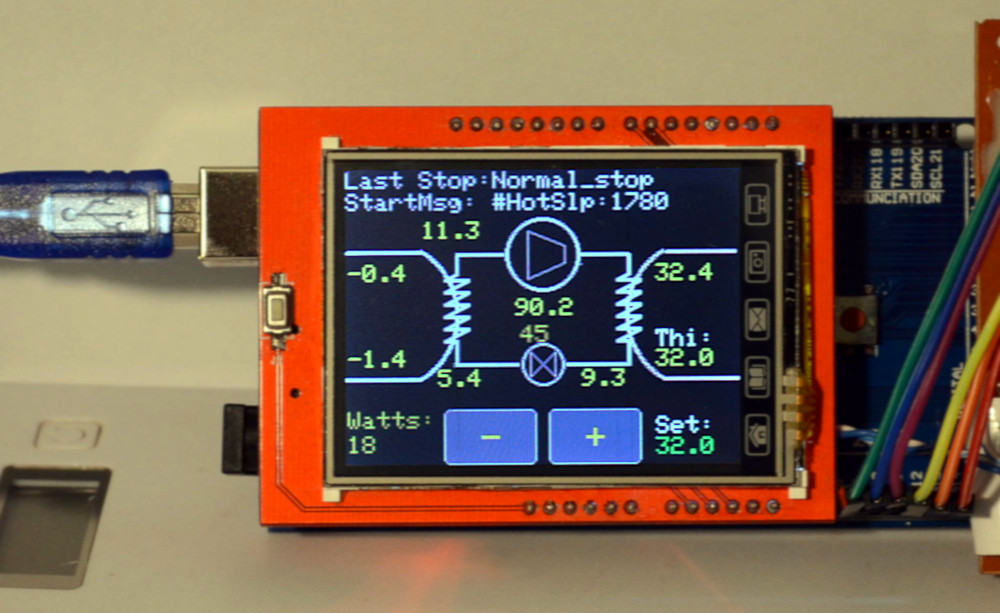

## Service Display

<b>The Service Display is a quickly assembled tool, that allows you to connect [Valden Heat Pump Controller](https://github.com/openhp/HeatPumpController/) to get maximum available information from sensors and show it graphically.</b>

## Preamble
One day I've realized that a netbook with a serial console is a very good diagnostic tool, but I want a more compact tool to get maximum available information from a Heat Pumps. So, this "Quickly Assembled Service Display" appeared. It fits everywhere and with a good power bank it can work 2-3 days long, without any additional power source. The diagnostic display is build from scratch, no PCB and housing here (and no plans to create it), because I do not see this device as a permanent-mounted display for the end user. 
If you want a compact and visual tool for your diagnostic purposes, this device is for you. 
 
If you don't need expert info from sensors and additional start/stop messages: check [Remote Display page](https://github.com/openhp/Display/), here you'll find end-user device with a very simple interface.  

## Bill Of Materials
BOM is very short:
| Part | Quantity |
| ------------- | ------------- |
| 100 Ω 0.25 Watt resistor | 2 |
| prototype PCB 50x70 | 1 |
| 2.54 legs (used only to hold prototype PCB at Arduino) | 1 |
| Arduino rs485 converter module | 2 |
| 2.4" TFT Display | 1 |
| Arduino Mega | 1 |

Display is as pictured below. Usually sold as "Arduino UNO TFT LCD". LCD driver chip is ILI9325. 
This is the cheapest one and widely available touchscreen LCD you can find. 
   

## Assembly and wiring
Mount converter modules, LCD and Arduino Mega.  
+5V, GND and signal ground wiring: 

- power source from both rs485 converters to 5V power at Mega board,
- GND from both GND,
- solder 100 Ω resistors for both "internal" and "external" converters: one output to ground and one to hole,
- place a short tail of wire to the nearest hole and solder to resistor output at back side.

 
  
Signal connections wiring: 

- solder DE to RE (both pins together),
- Internal DI to A8,
- Internal DE+RE to A9,
- Internal RO to A10,
- External DI to A11,
- External DE+RE to A12,
- External RO to A13,
- A and B wires.

 
  
Finally, use spring-loaded connectors. A fast installation-ready device will look like this:
  

Example of connection and usage at server side [here](https://github.com/openhp/HP-integration-example). 
You can ommit "to server" converter and connection if you'll use this device only as portable-only tool.  

## Firmware upload
The process is the same as for others Arduinos:
- connect USB,
- start Arduino IDE,
- open the firmware file,
- select board and MCU in the Tools menu (hint: we are using "Mega" board),
- press the "Upload" button in the interface.

For successful compilation, you must have "Adafruit_GFX" and "Adafruit touch screen" installed (see Tools -> Manage Libraries). 
Also all library files (*.cpp* and *.h*) from [Service Display repository](https://github.com/openhp/ServiceDisplay/) must me downloaded and located at the same directory as a main *.ino* file. 
That's all, easy and fast.  

## Start and usage
Just power on the device. 
For diagnostic text messages and abbrevations you'll meet on the display during usage see [Valden Heat Pump Controller](https://github.com/openhp/HeatPumpController/) page appendexes 
Interface shows all key temperatures at a slightly simplified standard refrigeration sheme, so no more comments. 
 
 
  

## License
GPLv3.   
This product is distributed in the hope that it will be useful,	but WITHOUT ANY WARRANTY; without even the implied warranty of MERCHANTABILITY or FITNESS FOR A PARTICULAR PURPOSE.  See the GNU General Public License for more details.  

## Author
 
gonzho АТ web.de (c) 2018-2021 

